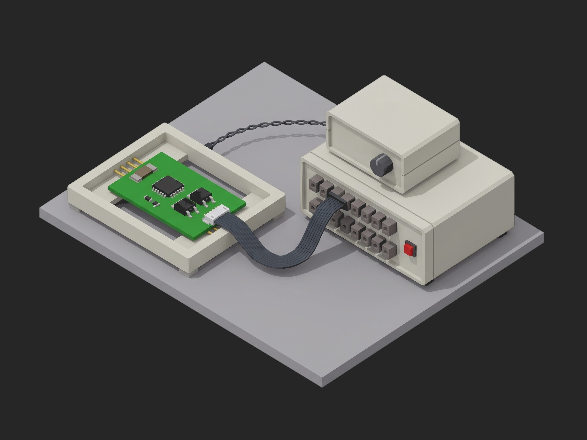

# Framework BMS Protection Trip Verification



A TofuPilot Framework procedure for the protection trip verification of a 16S BMS PCBA: the protection configuration read bit-exact before any stimulus, the over-voltage and under-voltage trip point and ALERT delay found on every channel by binary search on a cell simulator, the OCD and SCD thresholds found by voltage injection across the sense-resistor inputs with the DSG gate and the reset flags checked after the short, the over-temperature path checked by resistance substitution at two temperatures plus an open thermistor, and a teardown that parks the board and re-reads the configuration. The mock bench synthesizes a healthy board with every comparator inside the datasheet window and one OV channel 18 mV low.

## What This Shows

| Feature | Where |
|---------|-------|
| JSON `==` on a whole configuration object, before and after | `protection_config`, `faults_after_restore`, `reset_flags_after_scd` |
| Multi-dimensional measurements with two curves and aggregations on both | `ov_trips` / `uv_trips` -- `trip` (`max_dev_mv`, `min_dev_mv`), `delay` (`max_ms`) |
| Limits copied from the AFE datasheet, delay limits in quanta | `+-30 mV`, `<= 107 ms` (setting + 2 x 3.3 ms), `+-5 mV`, `+-20 %` |
| A measurement that tells a trip from a crash | `reset_flags_after_scd` next to `dsg_gate_after_scd_v` |
| A two-point check that catches a wrong NTC reel | `temp_at_25c`, `temp_at_60c` |
| Shared search helper imported across phases | `phases/uvp_trip.py` imports `find_trip` from `phases/ovp_trip.py` |
| Setup gate, teardown that always restores, sequential `depends_on` chain, timeouts | `procedure.yaml` |

## Get Started

1. Sign up for a free TofuPilot account at [tofupilot.app](https://www.tofupilot.app/auth/signup).
2. Open the **New Procedure** flow in the dashboard and clone this template.
3. Follow the dashboard's instructions to set up a station and run the procedure.

For deeper guides, see the [TofuPilot docs](https://www.tofupilot.com/docs/framework) and the [BMS Protection Trip Verification template page](https://www.tofupilot.com/templates/bms-protection-trip-verification).

## Structure

```
.
├── procedure.yaml                    # Procedure, plug, phases, measurements
├── phases/
│   ├── config_readback.py            # Setup: protection block and CRC, bit-exact
│   ├── ovp_trip.py                   # OV trip and delay per channel, binary search
│   ├── uvp_trip.py                   # UV trip and delay, one channel at a time
│   ├── overcurrent_injection.py      # OCD1 and SCD by SRP/SRN injection, gate, resets
│   ├── otp_thermistor.py             # Two-point NTC check, OTD sweep, open TS
│   └── restore.py                    # Teardown: stimulus off, faults cleared, CRC again
├── plugs/
│   └── protection_bench.py           # Mock cell simulator + injection + NTC + DUT UART
├── utils/
│   └── recipe.py                     # Released config, search windows, NTC model
├── pyproject.toml                    # uv-managed Python project
└── README.md
```

## Replace the Mock with Real Hardware

`plugs/protection_bench.py` maps to four links: the cell simulator over SCPI (Chroma 87001 or Keysight SL1010A), a current-sensor simulation channel driven onto the filter side of the shunt (a Bloomy or NI analog output, never across the shunt pads themselves at these voltages), a Pickering 40-297A programmable resistor on the TS pin, and the DUT's UART with the ALERT pin on a timer input. Time delays on the ALERT edge, not on a polled register. The phases, measurements and limits stay the same.
